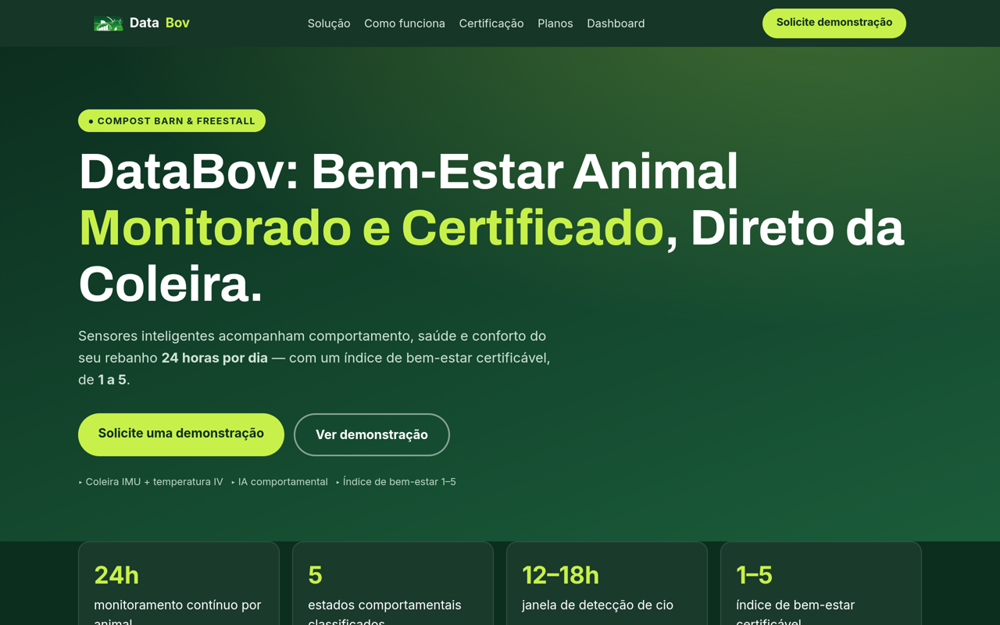
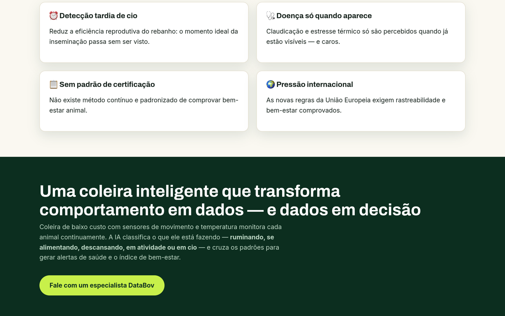

# 🏛️ PEÇA Nº 001 — DataBov (primeira versão)

> **Estado de conservação:** funcionando · **Visitação:** aberta · **Procedência:** o projeto que começou tudo

[](https://databov.vercel.app)

<a href="https://databov.vercel.app"></a>

## Galeria da peça 🖼️

**Sala 1 — o herói (hero + números):**
<a href="https://databov.vercel.app"></a>

**Sala 2 — o problema (avaliação pontual e subjetiva):**
<a href="https://databov.vercel.app"></a>

## Ficha catalográfica

| Campo | Registro |
|---|---|
| Título | DataBov — Bem-Estar Animal Monitorado e Certificado |
| Período | 2026, fase Compost Barn / Freestall |
| Técnica | HTML, CSS e JavaScript sobre telemetria MQTT |
| Dimensões | 1 landing (11 seções) + 1 dashboard ao vivo |
| Índice | Bem-estar certificável de 1 a 5 |

## Linha do tempo

- **2026 — esta peça:** landing de vendas + dashboard lendo a API do backend.
- **2026 — sucessora:** [**DataBov v2**](https://github.com/Wagner-Schemmer/databov-v2) assume a exposição ([visita virtual](https://databov-v2.vercel.app)).

## Restauração (rodar local)

```bash
git clone https://github.com/Wagner-Schemmer/monitoramento-animal-site.git
cd monitoramento-animal-site && python3 -m http.server
# contato/supabase: chaves em js/contact.js · telemetria: ver rebanho-vivo-backend
```

Salas do acervo: `index.html` · `dashboard.html` · `css/` · `js/` · `assets/`.

## Livro de visitas (star history)

<a href="https://www.star-history.com/#Wagner-Schemmer/monitoramento-animal-site&Date"></a>

---
Curadoria: [Wagner Schemmer](https://wagner-port.vercel.app) · [Portfólio](https://wagner-port.vercel.app)
