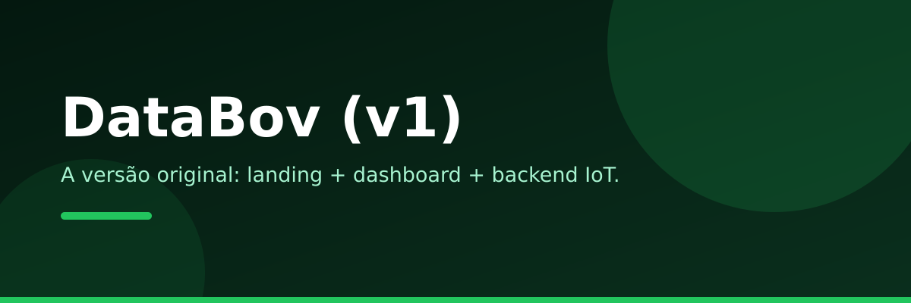

<div align="center">

[](https://github.com/Wagner-Schemmer/monitoramento-animal-site/stargazers)
[](https://databov.vercel.app)
[](https://databov-v2.vercel.app)


  <a href="https://databov.vercel.app"></a>

  <h1>DataBov · v1</h1>

  <p>
    <b>A versão original: landing + dashboard + backend IoT.</b>
    <br />
    Coleira inteligente com IA para Compost Barn e Freestall, índice de bem-estar de 1 a 5.
  </p>

  <p>
    <a href="https://databov.vercel.app"><b>Demo</b></a> ·
    <a href="https://databov-v2.vercel.app">Sucessor (v2)</a> ·
    <a href="#o-que-cada-pagina-faz">Páginas</a> ·
    <a href="#como-rodar">Como rodar</a> ·
    <a href="#stack">Stack</a>
  </p>
</div>

<a href="https://databov.vercel.app"></a>

> [!NOTE]
> Este é o site original do projeto. A versão atualizada mora em [**databov-v2**](https://github.com/Wagner-Schemmer/databov-v2) ([databov-v2.vercel.app](https://databov-v2.vercel.app)).

## O que cada página faz

| Página | O que tem |
|---|---|
| **Landing** | Hero, problema, solução, certificação, planos, specs, contato (11 seções de copy) |
| **Dashboard** | Status do rebanho ao vivo (lê da API do backend) |

## Como rodar

1. `python3 -m http.server` na pasta (ou Go Live no VSCode).
2. Para o formulário/contato: preencha as chaves do Supabase em `js/contact.js`.
3. Com o backend rodando, o dashboard mostra telemetria real.

## Estrutura

```
monitoramento-animal-site/
├── index.html          # landing (hero, problema, solução, certificação, planos, specs, contato)
├── dashboard.html      # status do rebanho ao vivo (lê da API do backend)
├── css/                # variables, components, style (identidade verde DataBov)
├── js/main.js          # reveal + demo do acelerômetro
├── js/dashboard.js     # telemetria e alertas da API
├── js/contact.js       # form de contato -> Supabase (preencha as chaves)
└── assets/             # databov-logo.png (logo), favicon
```

## Personalizar

1. Chaves do Supabase em `js/contact.js`.
2. Textos em `index.html` (seguem o documento de copy de 11 seções).
3. Deploy: conectar o repo na Vercel (site estático, zero config).

## Stack

HTML · CSS · JavaScript. Backend em [`rebanho-vivo-backend`](https://github.com/Wagner-Schemmer/rebanho-vivo-backend).

## Quem faz

<a href="https://github.com/Wagner-Schemmer/monitoramento-animal-site/graphs/contributors"></a>

## Star history

<a href="https://www.star-history.com/#Wagner-Schemmer/monitoramento-animal-site&Date"></a>

---
Feito por [Wagner Schemmer](https://wagner-port.vercel.app) · [Portfólio](https://wagner-port.vercel.app) · [LinkedIn](https://www.linkedin.com/in/wagner-schemmer-martins-46950627a)
